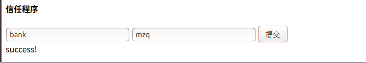

## **中山大学数据科学与计算机学院本科生实验报告**

#### **（2019年秋季学期）**

​	课程名称：区块链原理与技术						任课教师： 郑子彬

| 年级     | 17          | 专业（方向） | 软件工程          |
| -------- | ----------- | ------------ | ----------------- |
| 学号     | 17343089    | 姓名         | 莫智强            |
| 电话     | 18877409509 | Email        | 2439777344@qq.com |
| 开始日期 | 2019.12.01  | 完成日期     | 2019.12.13        |

### 一、项目背景


举个例子，假设企业A在某个金融机构（比如银行）的监督下与企业B签订了1000万的协议，比如车企购买轮胎，但是问题是轮胎厂实际上没有拿到企业A的钱，所以资金不足的时候凭借A的信用是可以到银行申请贷款，但是如果企业B需要原料又跟企业C签订了协议，比如300万，那么企业C没有拿到钱，但是企业C不能拿到银行的贷款，因为银行认为企业B没有足够的能力还款。所以工作是将A所需的这批所有轮胎的流程我们进行透明化，使得企业C以及后面的企业可以凭借A的信用去贷款。

- 功能一：实现采购商品—签发应收账款交易上链。例如车企从轮胎公司购买一批轮胎并签订应收账款单据。 

- 功能二：实现应收账款的转让上链，轮胎公司从轮毂公司购买一笔轮毂，便将于车企的应收账款单据部分转让给轮毂公司。轮毂公司可以利用这个新的单据去融资或者要求车企到 期时归还钱款。 
- 功能三：利用应收账款向银行融资上链，供应链上所有可以利用应收账款单据向银行申请融资。 
- 功能四：应收账款支付结算上链，应收账款单据到期时核心企业向下游企业支付相应的欠款。

 

### 二、方案设计

#### 存储设计

没有使用数据库，因为nodejs-sdk提供的数据库接口不太会使用，所以直接把数据存储在合约里面，表现形式是多个数组，比如账户名、账户类型、账户金额等等。然后每次进行操作就找到对应的下标即可。相当于一个简易版数据库。

#### 数据流图


#### 核心功能介绍

##### 前端

前端的代码还是比较长的，而且每个部分都是基本相同的，都是一些输入框、一个提交按钮以及一个显示区域。

所以只分析一个部分即可。

```html
 <div>
    <h4>注册账户</h4>
  <h5>账户类型:0代表银行,1代表个人账户</h5>
    <input type="text" placeholder="请输入账户名" v-model="d1_1"/>
    <input type="text" placeholder="请输入账户类型" v-model="d1_2"/>
    <input type="text" placeholder="请输入账户初始金额" v-model="d1_3"/>
    <input type="button" value="提交" @click="handlefunc1"/>
    <div>{{msg1}}</div>
  </div>
```

因为使用的vue，所以可以动态渲染，所以交互看起来还是很不错的。

上面出现的handlefunc1是处理点击事件的函数，也是比较重要的：

```html
 handlefunc1(){
          axios.get('http://localhost:3000/api',{
            params:{
              type:1,
              account: this.d1_1,
              account_type:this.d1_2,
              account_asset:this.d1_3
            }
          }).then(res=>{
              this.msg1 = res.data.result1;
            }).catch(err=>{
              this.msg1 = err;
            });
        },
```

上面的点击事件处理函数其实就是向写好的后端服务器发送get请求，然后携带一些后端处理必须的参数，这里是处理注册功能的，所以发送的参数（自定义的，根据自己程序设计传递的参数）是

- type：前端想要处理的类型，通过我们自己定义好的不同的type，后端就能判断我们想要执行什么函数
- account：账户名
- account_type：账户类型
- account_asset：账户资产

这样后端就能根据type确定需要执行注册的函数，然后参数就是剩下的三个值。然后then后面其实就是相当于回调，后端进行逻辑处理后也会返回一个约定好json格式，然后我们按照约定的格式就能取得返回的信息，这里返回的信息是一个string，注册成功就是“success”，失败是“error”

这样一个完成的处理函数就写好了，其他功能的也是大致一样的

##### 后端

同样后端的代码也是比较冗余的，也拿其中一个处理函数说明，就是处理上诉前端注册功能的函数：

```javascript
 if (get_data.type == 1){
            var data1 = get_data.account + "";
            var data2 = get_data.account_type + "";
            var data3 = get_data.account_asset + "";
            var sendarr = new Array(data1,data2,data3);
            api.sendRawTransaction(Addr,"register(string,int256,int256)",sendarr).then(value=>{
                // console.log(value.output);                   
                // console.log(utils.decodeParams(returnarr,value.output));
                var returnarr = new Array("int256");
                var temp = utils.decodeParams(returnarr,value.output);
                var returndata;
                if (parseInt(temp[0]) == -1) {
                    returndata = "this account has been used!";
                }
                if (parseInt(temp[0]) == 0) {
                    returndata = "register success";
                }
                var json = JSON.stringify({
                    result1:returndata,
                });
                res.write(json);
                // console.log(json);
                res.end();
            }).catch(err=>{
                console.log(err);
            });
        }
```

首先get_data是我们处理好了前端数据，现在已经是json格式了，比较方便使用了。可以看到代码的开始就是判断type是否等于1，这就是上面前端说到的发送type的原因，根据不同的type进行不同的逻辑处理，然后这段代码执行的主要就是后端和链端交互的主要流程，拿到想要的参数，我们可以使用nodejs-sdk接口调用智能合约，然后智能合约返回参数，这就是我们想要的参数，然后进行简单的逻辑处理并且转换成json格式返回前端，一个完整的**前端+后端+链端**流程。

至于调用智能合约，个人感觉是一个很坑的地方，官网上虽然给出给口怎么使用，可是欠缺例子，其实很多参数到底怎么输入也是模棱两可，不过好像cli里面也可以找到对应的函数，这是自己去找出来的例子。

##### 链端

智能合约代码：

```solidity
pragma solidity ^0.4.21;

contract Final_3{
    
    struct Deal{
        string bank;
        string account_A;
        string account_B;
        int256 start_time;
        int256 end_time;
        int256 limit;
    }
    
    struct Bank_turst_list{
        string name;
        string[] trust_user; 
    }
    
    struct Payback{
        string account_A;
        string account_B;
        int256 money;
        int256 final_time;
        int256 flag;
    }
    
    int256 now_time;
    string[] account;
    int256[] account_asset;
    int256[] account_type;
    Deal[] deal_list;
    Bank_turst_list[] trust_list;
    Payback[] payback_list;
    
    function constructor () public {
       now_time = 0;
    }
    
    // 
    function find_index_in_account(string a) public returns(int256){
        for (uint256 i = 0; i < account.length; i ++){
            if (keccak256(a) == keccak256(account[i])) return int256(i);
        }
        return -1;
    }
    
    function get(uint256 index) public returns(string){
        return account[index];
    }
    
    //-1 error else >0 = success
    //type 0==bank 1==user
    function register(string a, int256 b, int256 money) public returns(int256) {
        int256 index = find_index_in_account(a);
        if (index != -1) return -1;
        else {
            account.push(a);
            account_type.push(b);
            account_asset.push(money);
        }
        return 0;
    } 
    // first parama represent success or error
    function select(string a) public returns (int256,string,int256,int256) {
       int256 index = find_index_in_account(a);
       if (index == -1) return (-1,"error",0,0);
       return(0,account[uint256(index)],account_type[uint256(index)],account_asset[uint256(index)]);
    }
    
    function transfer(string a, string b, int256 amount) public returns (int256) {
        int256 index1 = find_index_in_account(a);
        int256 index2 = find_index_in_account(b);
        if (index1 == -1) return 0;
        if (index2 == -1) return 1;
        if (account_asset[uint256(index1)] < amount) return 2;
        
        account_asset[uint256(index1)] -= amount;
        account_asset[uint256(index2)] += amount;
        return 3;
    }
    
    // 0->not find a 1->not find b 2->not find bank 3->success
    function make_deal(string bank, string a, string b, int256 start, int256 end, int256 limit) public returns(int256){
        if (find_index_in_account(a) == -1) return 0;
        if (find_index_in_account(b) == -1) return 1;
        if (find_index_in_account(bank) == -1) return 2;
        Deal memory deal = Deal(bank, a, b, start, end, limit);
        deal_list.push(deal);
        if (is_bank_trust_account(bank,a) == 1) trust(bank, b);
        else if (is_bank_trust_account(bank,b) == 1) trust(bank,a);
        return 3;
    }
    
    function trust(string bank, string user) public returns(int256){
        if (find_index_in_account(user) == -1 || find_index_in_account(bank) == -1) return 0;
        int256 t1;
        string memory t2;
        int256 t3;
        int256 t4;
        (t1,t2,t3,t4) = select(user);
        if(t1 == -1 || t3 != 1) return 1;
        (t1,t2,t3,t4) = select(bank);
        if (t1 == -1 || t3 != 0) return 1;
        
        for (uint256 i = 0; i < trust_list.length; i ++){
            if (keccak256(trust_list[i].name) == keccak256(bank)) {
                trust_list[i].trust_user.push(user);
                return 2;
            }
        }
        string[] arr;
        arr.push(user);
        Bank_turst_list memory li = Bank_turst_list(bank, arr);
        trust_list.push(li);
        return 2;
    }
    
    // -1== other error , 0 == no, 1 == yes
    function is_bank_trust_account(string bank, string account) public returns(int256){
        if (find_index_in_account(bank) == -1 || find_index_in_account(account) == -1) return -1;
        for (uint256 i = 0; i < trust_list.length; ++ i){
            if (keccak256(trust_list[i].name) == keccak256(bank)) {
                for (uint256 j = 0; j < trust_list[i].trust_user.length; ++ j){
                    if (keccak256(trust_list[i].trust_user[j]) == keccak256(account)) return 1;
                }
            }
        }
        return 0;
    }
    
    // 0 = error  1 = success
    function load(string a, string bank, int256 amount, int256 end_date)  public returns(int256){
        int256 index1 = find_index_in_account(a);
        int256 index2 = find_index_in_account(bank);
        if (index1 == -1 || index2 == -1) return 0;
        if(is_bank_trust_account(bank,a) == 1) {
            account_asset[uint256(index1)] += amount;
            account_asset[uint256(index2)] -= amount;
            payback_list.push(Payback(a, bank, amount, end_date,0));
            return 1;
        }
        return 0;
    }
    
    function checkNeedToPay() public {
        for (uint256 i = 0; i < payback_list.length; ++ i){
            if (payback_list[i].final_time <= now_time && payback_list[i].flag == 0){
                int256 index1 = find_index_in_account(payback_list[i].account_A);
                int256 index2 = find_index_in_account(payback_list[i].account_B);
                account_asset[uint256(index1)] -= payback_list[i].money;
                account_asset[uint256(index2)] += payback_list[i].money;
                payback_list[i].flag = 1;
                // i = i + 1
                // for (uint256 j = i; j < payback_list.length - 1; ++ j){
                //     payback_list[j] = payback_list[j + 1]; 
                // }
                // delete(payback_list[payback_list.length - 1]);
                // -- i;
            }
        }
    }
    
    function setTime(int256 time) public returns(int256){
        now_time = time;
        checkNeedToPay();
        return 1;
    }
}
```

这个就是智能合约的完整代码，主要是根据大作业的功能设计一些函数，其实跟写C++程序一样。

这里主要是设计了几个存储数据的数组，所有信息都是存在合约里面的，所有合约一旦部署，信息就会永久存在上面。还根据一些账单或者信任链设置了一些结构体用于存储。其他都是一些很正常的逻辑，比较觉得的是我定义了很多string[] 数组，想要每次遍历数组与函数传入的string值进行比较，结果string[]里面存的是引用，所以需要使用keccak256函数取得string的哈希值然后才能进行比较，这里就比较坑。

还要注意uint256类型和int256类型的转换，容易报错，但是也很容易改，像C语言一样进行强制类型转换就行。 

### 三、功能测试

#### 准备工作

首先先开启区块链节点


成功开启节点后，开启服务器，运行后端代码


可以看到服务器在3000端口一直等待请求


运行写好的前端页面


#### 正式测试

首先后端先要部署了合约的，而后端就是根据我们部署好的合约调用函数进行逻辑操作的。

##### 功能：注册账户


点击提交下方会放回成功或者失败信息

用户名是主键，相同名字注册过不能重复注册


**用此方法我们分别注册了mzq，myz，msb，bank四个账户，余额分别为1000,2000,3000,100000**

##### 功能：查询账户


成功查询到会返回用户信息（名字，类型，余额），失败会提示没有注册


##### 功能：转账


转账成功，查询myz余额看是否发生变化


余额正确，转账成功

##### 功能：贷款


没有因为bank没有信任mzq，因此是不能完成贷款操作的，但是这个提示错误信息是不对的，这里有待改进，不过无伤大雅

想要成功贷款，必须获得银行信任

##### 功能：信任程序



执行成功之后，再进行贷款，不出意外的话mzq应该可以向银行贷款


成功向银行贷款，查询余额


看到余额确实增加了

同样如果此时msb向银行贷款也是借不到的


果然，那么如果msb想要取得银行贷款，那么就需要获得bank的信任，这就是大作业的核心内容了，msb如果和mzq签订协议的话，也就可以间接获得银行的信任，那么msb就可以贷到款

##### 功能：签订证书


上图是先执行下面签订协议，然后进行贷款，看到msb成功贷到款，所以查询一下是否属实


确实成功了

供应链金融的信任关系是可以一直往下传递的，因此如果myz和msb签订协议，那么myz也是可以通过mzq在银行的信用得到银行的贷款


可以看到myz也是成功贷到款了，功能实现（2900=初始 2000 - 转账给mzq 100 + 贷款 1000）

##### 功能：到期自动还款

为此我们需要定义一个设置系统功能的函数，为了方便测试我们自动还款功能


设置成功，设置成1000是为了让以上的所以交易记录都已经过了还款日期

查看每个账户的余额信息


可以看到所有的贷款已经归还了，金额是正确的。

至此，所以功能测试完毕

### 四、界面展示

上一步已经基本看到了所有的界面，现在来看比较完整的前端页面。


以上就是一个完成的前端页面，初始时候所有输入框为空，有各自的提示页面，然后填写对应部分的信息，然后提交，下方会显示对应的信息，不论是成功还是报错

信息会一直停留，没有动画效果，因为两次输出的结果你会看起来觉得没有响应，其实不是

### 五、心得体会

关于大作业，还感觉还是一言难尽的。刚开始的时候跟着官网开始做，然后慢慢开始使用sdk，选择自己开发的sdk，这些都是十分痛苦的事情，因为期间遇到了各种各样的坑，往往一个很小的问题可能都是花费半天的时间，很是耗时。然后大概清楚了怎么使用sdk之后也还是有很多坑要踩，虽然实训和服务计算以及以前的web都有涉及前后端的开发，但是我觉得真正自己完成一个想对完整的前后端这还是头一次，因为前段时间实训恰好看了一段时间的vue，所以前段对于我来说还是想对简单的，但是后端的话还是蛮不熟悉的，所以基本上都是在百度百度，然后遇到了各种各样的问题，数据格式的转换，GET请求和POST请求要解决跨域的问题等等，甚至刚开始的时候你甚至都不知道这个bug是什么问题。然后后端与链端的结合更是令人头疼，一个最主要的问题就是异步回调问题，nodejs-sdk中对于区块链的操作一般都是异步函数，所以刚开始不会使用经常传回来undefined的东西。然后还要对返回的output进行解码等等。以及编写solidity智能合约的时候也发现了上一次写的合约根本无法运用到这次的作业上，因为使用nodejs-sdk对用户公钥的处理是相当麻烦的，甚至我不知道怎么处理address这个类型，所以直接索性把数据存在合约中，而且省去使用数据库。上面碰到的都是很多很多的坑，看起来蛮痛苦的。这个开发过程也是相对漫长，因为还有其他科作业，压力很大。但是最后终于把前端+后端+链端联系起来还是很开心的，感觉还是蛮有成就感的，虽然相比于别人的肯定不是最好，但是对于自己的进步还是很欣慰的。同时每次遇到这些坑，以及对于大作业的思考，都会让我对我区块链有了新的认识，当然还有一些额外的知识比如前端后端。现在我的感觉就是我可以把合约和前端后端完善得更好，但是因为时间的原因，现在的成果大概就这样了。所以可以改进的地方还有很多，比如更完善的智能合约，或者更友好的前端，但是我觉得我这个简洁的前端也是可以的，简洁也是一种美，关键是我们后端的逻辑无懈可击才是最厉害的。第一次完成了全栈的开发，收获满满，对得起踩过的这么多坑。想要提升自己，这些痛苦都是必须经历的呀。后面的路还得加油呀。